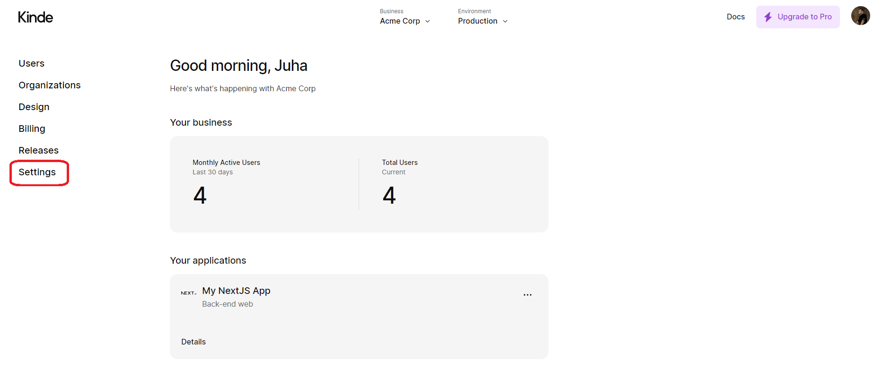
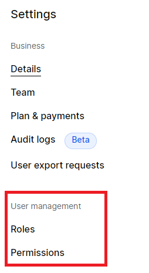
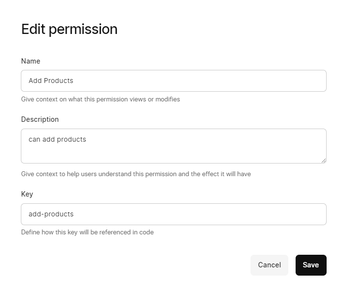
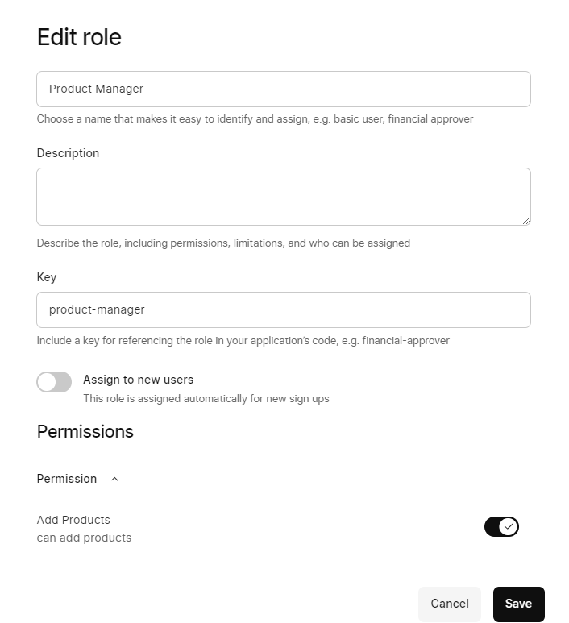

# Ohjeet

## Projektin käyttöönottaminen paikallisesti

### Vaatimukset

#### Perus ohjelmistot

- [Node.js](https://nodejs.org/en/) > v18
- [NPM](https://www.npmjs.com/) > v9
- [Git](https://git-scm.com/)

#### Tunnukset

- [Kinde](https://kinde.com/)
- [Cloudinary](https://cloudinary.com/)

### Asennus

:::info
Varmista että sinulla on pääsy projektiin GitHubissa.

Ota tarvittaessa yhteyttä `juha.savikko@tuni.fi` tai `dev.juhamikael@gmail.com`
:::

#### 1. Aloita kloonaamalla projekti

```bash
git clone https://github.com/juhamikael/ICT-Project-Feedback-Solution.git
```

#### 2. Siirry projektin juureen

```bash
cd ICT-Project-Feedback-Solution
```

#### 3. Asenna tarvittavat riippuvuudet

```bash
npm install
```

---

#### 4. Luo `.env` tiedosto projektin juureen

ja lisää siihen seuraavat ympäristömuuttujat:

```bash
# .env
DATABASE_URL=sqlite.db

NEXT_PUBLIC_CLOUDINARY_CLOUD_NAME=<cloud-name>
NEXT_PUBLIC_CLOUDINARY_API_KEY=<api-key>
CLOUDINARY_API_SECRET=<api-secret>

CLOUDINARY_URL=cloudinary://<api-key>:<api-secret>@<cloud-name>

KINDE_CLIENT_ID=<client-id>
KINDE_CLIENT_SECRET=<client-secret>
KINDE_ISSUER_URL=<issuer-url>
KINDE_SITE_URL=http://localhost:3000
KINDE_POST_LOGIN_REDIRECT_URL=http://localhost:3000/api/auth/success
KINDE_POST_LOGOUT_REDIRECT_URL=http://localhost:3000/products

```

:::info
Sekä Cloudinary että Kinde tarjoavat ilmaiset tilit ja tilin luominen on helppoa sekä nopeaa.

Molemmat palvelut tarjoavat API avaimet tilin / projektin asettamisen yhteydessä.

Joten ennen projektin käynnistämistä, varmista että sinulla on molemmat avaimet saatavilla.
:::

---

#### 5. Konfiguroi Cloudinary ja Kinde palvelut

:::warning

WIP

:::

##### Cloudinary

1. Aloita uploadaamalla Cloudinaryyn projektin juuressa `.cloudinaryImages` olevat kuvat.

##### Kinde

1. Luo uusi projekti Kindeen ja seuraa ohjeita.
2. Projektin luomisen jälkeen navigoi projektiin ja sivulle **settings**

   

3. Avaa sivut **Roles** ja **Permissions** uusiin välilehtiin

   

4. Luo **permission**

   - **Name** = `Add Products`
   - **Description** = `Add products to the store`
   - **Key** = `add-products`

   

5. Luo Rooli

   - **Name** = `Product Manager`
   - **Description** = `Manage products` / _voi olla tyhjä_
   - **Key** = `product-manager`
   - Rullaa alas ja aseta aiemmin luomasi **permission** roolille

   

#### 6. Tietokanta

:::info
Voit halutessa käyttää kloonauksen mukana tulevaa sqlite.db tiedostoa, jolloin sinun ei tarvitse luoda omaa tietokantaa.

:::

Mikäli kuitenkin haluat luoda oman tietokannan:

```bash
npm run db:generate
```

Tämä luo uuden migraatio tiedostot sqlite.db tiedostoa varten.

```bash
npm run db:migrate
```

Tämä luo tietokannan ja ajaa migraatiot.

---

#### 7. Käynnistä projekti

```bash
npm run dev
```

---
